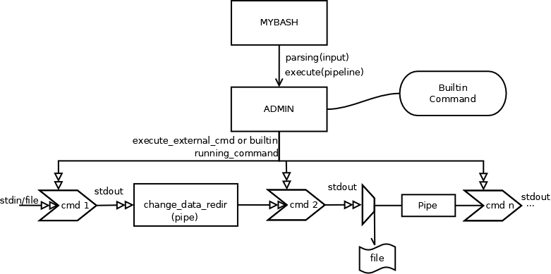

<h1 align="center">Laboratorio 1 - Sistemas Operativos 2022 - Mybash</h1>

*Programando nuestro propio shell de linux*

## McLovin Operativo :whale:

**INTEGRANTES:**

* Alejo Corral: alejo.corral@mi.unc.edu.ar
* Nahuel Fredes: nahuelfredes2018@mi.unc.edu.ar
* Francisco Martiarena: franciscomartiarena@mi.unc.edu.ar
* Ignacio Martinez Goloboff: ignacio.martinez.goloboff@mi.unc.edu.ar

### Introducción
Este laboratorio consiste en la realización de una shell al estilo de bash (Bourne Again Shell)
la cual fue programada en el lenguaje C.
La consola realiza diversas funciones generales tales como:

* Ejecución de comandos internos o externos (background o foreground)
* Redirección entre comandos a través de un pipe
* Redirección de entrada y salida estándar

### *Modularización:*
Como la consigna pedía, utilizamos una modularización de 5 partes (sin incluir el módulo parser)

* **MyBash** (Martinez, Martiarena, Fredes, Corral)

        Módulo principal el cual invoca alternadamente al procesador de entrada y al ejecutor.
        En definitiva, conecta todos los módulos que hacen al funcionamiento del programa.
        
* **Command** (Martinez, Martiarena)
        
        Implementación de TADs scommand y pipeline, los cuales proveen una representación abstracta de los comandos. 
        El scommand, o comando simple, consiste en una secuencia de cadenas, las cuales comienzan con el comando y lo 
        siguen sus argumentos, con dos cadenas adicionales para redirecciones de entrada y salida. El pipeline, o tubería, 
        se presenta como una secuencia de comandos simples, con un booleano que indica si se debe ejecutar en segundo plano 
        o no. Para estos se utiliza la librería glib, en particular usamos GSList la cual es una estructura que nos da glib 
        representando una lista simple, tiene un puntero a un dato y un puntero al siguiente de la lista.
        
* **Parsing** (Corral, Fredes)

        El parsing o análisis sintáctico consiste en traducir la entrada estándar en un pipeline.
        Para realizar dicha tarea se va consumiendo
        el stdin mediante el módulo parser(implementado por los docentes).
        Se hace uso del patron que debe seguir un comando para poder parsearlo en el tad.
        Se agregaron reforzamientos para entradas dudosas o mal escritas, cuando algo no salió como lo esperado
        se consume todo el stdin y se comienza a parsear desde 0. 
        
          
* **Builtin** (Corral, Fredes)

        Su objetivo principal es ver si un comando es interno y ejecutarlo. Tiene un par de funcionalidades:
        
                -builtin_is_internal, indica si el comando es interno o no. Para ello se utiliza el comando interno de bash 
                "type", el cual nos permite poder reconocer los casos de cuando corremos un cmd interno de linux no definido
                en nuestro mybash, poder prevenir de ejecutarlo como externo. Su implementación consiste en la utilización 
                de la función System(libreria <stlib.h>), la cual realiza una sistem call "execl". Por lo que requerimos 
                usar un fork y un pipe para conectar el output del proceso hijo (que realiza el system) con el padre(mybash).
                
                -builtin_run, ejecuta el comando interno. Esto lo hace comparando el command con una lista de internos 
                implementados predefinida (help, cd, exit, echo)
                
                -builtin_is_alone, indica si la tubería tiene un solo comando simple y si este interno.
         
* **Execute** (Martinez, Martiarena, Corral)

        Es el que recibe el pipeline con los comandos simples ya parseados. La idea ahora es podes ejecutarlos de la 
        manera mas eficiente posible, cubriendo casos bordes, conectando procesos a través de pipes y redireccionando 
        su salida para poder satisfacer el pedido del usuario.
        
        Para el flujo de ejecución tuvimos dos diseños diferentes, uno que funciona en serie y otro en paralelo.
                -Ejecución en paralelo: El padre crea todos los procesos hijos de una sola vez. El flujo de datos se puede 
                dar de manera continua, osea que un proceso lee del otro hasta que no mande más.
                -Ejecución en serie: El padre crea cada proceso hijo luego de que haya terminado de ejecutarse el anterior, 
                ya habiendo mandado la salida por el pipe completamente.
        
                Nos dimos cuenta de que implementando en paralelo es mucho más ventajoso que en serie, si el proceso
                contiguo quiere ir consumiendo los datos del pipe, puede ir haciendolo y asi mentener el pipe en un tamaño acotado,
                liberando así mucha memoria ram. En caso que el proceso contiguo necesite que el anterior termine, solo esperará
                a que el otro cierre el pipe de escritura.

        Funciones para la ejecución en paralelo;
                -command_admin: Primera modularización que se usa, acá entra el pipeline a ejecutar
                si no es un único comando interno. Este módulo, se encarga de darle vida a cada comando mediante el uso del módulo
                running_command. Tambien crea los arreglos que se van a usar para guardar los file descriptor de los pipes, que luego seran
                usados para la intercomunicación de los comandos. command_admin es un proceso independiente del
                bash, este criterio de diseño nos sirve para poder corer pipelines en modo background. En caso de necesitarlo 
                no se espera desde el modulo execute_pipeline al command_admin y en caso contrario si (utilizando wait).

                -create_pipes: Este módulo se encarga de llamar la syscall pipe()
                la cual se comunica con el SO para reservar los recursos necesarios para los pipes. 
                Luego esta devuelve los files descriptor para que el command_admin pueda utilizarlos.

                -running_command: Aca es donde se ejecuta cada comando. Llamamos a fork().
                Primero, si el comando lo especifica, se cambia los file descriptor para redirecciones de entrada y 
                salida llamando a change_data_redirection y por último se fija si el comando a ejecutar es 
                interno(entonces lo ejecutamos con builtin_run) o externo(se llama a execute_external_command()).

                -change_data_redirection: 
                En este módulo vemos si hace falta redireccionar una entrada o salida con la ejecución del proceso. También se hace el cambio 
                del stdin y stdout por el fd de la punta correspondiente del pipe de cada proceso.(Notar que esto varía según si es 
                el primer comando del pipeline, el último, o uno que está en el medio). Esto lo hacemos llamando a dup2().
                -execute_external_command: En esta función ejecutamos el comando simple externo llamando a execvp.
                -destroy_output_pipes: Cerramos, una vez finalizados todos los comandos, las puntas restantes de los pipes desde el proceso padre.
                -duplicate_output: Si el comando no es el último, entonces abre el archivo ya redireccionado por el proceso, lo lee y
                manda el contenido por el pipe al siguiente proceso. Con esta función nos aseguramos que se pueda hacer
                algo como "ls > h.txt | grep a".

### Herramientas 
        Programado en lenguaje C, editor de texto VsCode. Utilizamos gdb y valgrind para debugging. Manejo de compilado 
        mediante MakeFile.
        
### Técnicas de Programación
        Aplicamos la técnica de programacion defensiva. Bibliotecas utilizadas: glib, string, syscalls.
        Trabajamos con comentarios para el mayor entendimiento del codigo lo cual facilitó la division
        de tareas/modulos.
        Realizamos planificación prevía antes de confrontar cada etapa para así, proponer correctas modularizaciones y
        poder llevar a cabo la tarea grupalmente.

### Proceso de Desarrollo:

        Comenzamos trabajando en el módulo command, el cual era la primera parte a desarrollar para luego poder implementar
        los demás. Un problema que se nos presentó fue al utilizar la función strlen en un char creado sin el caracter de
        finalización '\0', la cual nos daba error. Y también otros errores de Segmentation Fault los cuales pudimos solucionar
        con la herramienta de debugging gdb. Notar que no usamos la strextra ya que nos parecio mas simple utilizar
        las funciones que nos provee la libreria string, pero sin dejar de lado el entendimiento de la misma.
        
        Posteriormente, procedimos a trabajar en paralelo, ya que contábamos con los object
        compartidos por los profesores. 
        
        En el parsing, se utilizó el parser ya implementado. Este nos brindaba métodos para consumir la entrada
        y así ir traduciendo del lenguaje natural a información lista para el TAD pipeline. Esta etapa es la que tiene
        contacto directo con el usuario y debe ser robusta para entradas invalidas. Cuando detectabamos una entrada invalida
        simplemente consumimos toda la entrada y no devolvemos nada (NULL). Las especifiaciones del parser eran claras, concisas 
        y no generaron problemas para su uso. El único detalle del parser sería que deja memory-leaks, probamos crear un parser, luego
        eliminarlo con su método y queda memoria reservada. 
        Luego en el builtin. Primero realizamos una implementación del type, antes explicado, con archivos temporales para
        comunicarnos entre procesos. Después de ver y comprender el uso de los file descriptors y pipes, cambiamos dicha 
        implementación. El problema principal surgió al querer usar el comando type ya que system() requería "bash -c" debido 
        a que no nos tomaba los argumentos(-t)
        Execute, primero empezamos con la implementación de múltiples pipelines(*) y sin modularizar el código, lo cual fue corregido
        después.
        
        MyBash fue el módulo menos modificado. Se personalizó el prompt(*) y se crea/ejecuta/destruye pipeline.
        Debido a que nosotros hicimos una implementación/agregados diferentes al código, los cuales nos llevan a tener errores
        cuando corremos los tests (en particular en el execute.c y builtin.c). Estos son debido a que hicimos "puntos estrella (*)"
        distintos a los de la consigna y a la hora de hacer las pruebas no son tenidos en cuenta. Por lo cual creamos una branch
        "tests_100percent" la cual cumple con la consigna de correr e 100% de las pruebas. Las principales diferencias de las ramas 
        son, no se utiliza el type en builtin, por lo tanto, no se hace fork y tampoco se crea el proceso admin en el execute.

  

### Puntos estrella:
* Pipes multi-comando (cantidad arbitraria de comandos simples)
* Muestra de la ubicación del bash
* Utilizacion de comando type en la funcion builtin_is_internal.
* Implementación de comando interno: echo 
* Duplicación de output (archivo y pipe)

### Conclusiones:
        Este proyecto nos trajo un gran desafio, utilizar syscalls. Mediante técnicas de
        modularización y mucha lectura pudimos llevar a cabo su implementación grupal y 
        exitosamente. 
        Pudimos concretar todos los apartados de la consigna y agregar un par de funcionalidades 
        extras. 
        Fueron interesantes los diferentes erroes que tuvimos que ir solucionando. Relacionados a 
        la memoria dinámica y a las tareas multi-proceso, las cuales nunca habiamos enfrentado.
        
